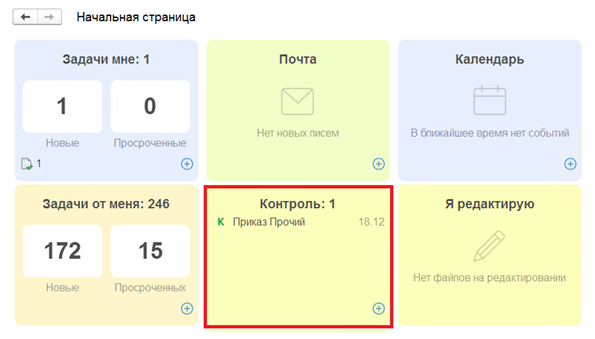
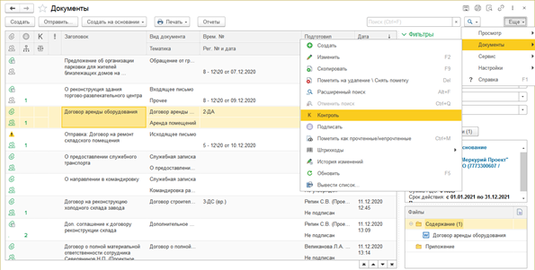
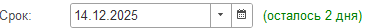
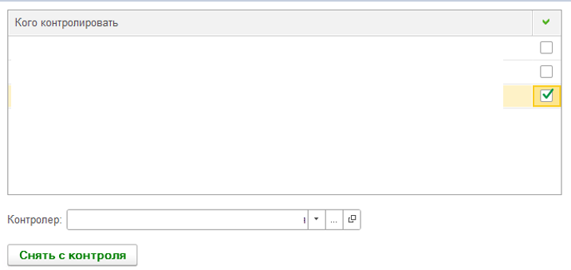

В 1С: Документооборот предусмотрена возможность следить за сроками и ходом выполнения работ по всем контролируемым объектам на начальной странице в одном виджите  **Контроль.**

{width=595px height=339px}

В любой момент можно перенести контрольный срок, проконтролировать отдельных пользователей, снять объект с контроля, вывести аналитические отчеты и посмотреть, какие документы находятся на контроле у коллег. При этом программа сама отследит истекающий (либо пропущенный) срок контроля и сообщит об этом по почте.

Чтобы поставить объект на контроль, необходимо выполнить команду Контроль в меню **Еще – Документы списка** или карточек объектов.

{width=595px height=301px}

Или из карточки документа, нажав на **К.**

<image src="./kontrol-ispolneniya-dokumenta-3.png" crop="0,0,100,100" scale="77" objects="annotation,22.6415,6.6365,,top-left&annotation,42.8157,36.8024,,top-left&annotation,26.8505,43.8914,,top-left&annotation,30.6241,82.0513,,top-left&annotation,22.6415,87.7828,,top-left" width="689px" height="663px" float="center"/>

**1\.Что контролировать**

Текст добавляется автоматически на основании заголовка документа. Описание можно дополнить.

**2\.Контрольный срок**

{width=371px height=28px}

До какого числа выполнить задачи по документу.

**3\.Список контролируемых**

Если в списке  указано несколько исполнителей, первый считается ответственным и выделяется жирным шрифтом. Чтобы поменять ответственного контролируемого воспользуйтесь стрелками {width=69px height=34px}

**4\.Кто выступает контролером**

По умолчанию указан текущий пользователь.

**5\.Нажать по завершении**

{width=202px height=31px}

Если кто-то из контролируемых выполнил свою часть работы, то в окне контроля необходимо установить флажок  и закрыть окно контроля.

{width=716px height=339px}

<note type="danger">

**Кнопка <highlight color="mint-green">"Снять с контроля"</highlight> снимает полностью документ с контроля**

</note>

Для отображения объектов, поставленных на контроль, в списках документов предусмотрена специальная колонка. Если дважды по ней кликнуть, то откроется окно контроля объекта.

<view display="List"/>